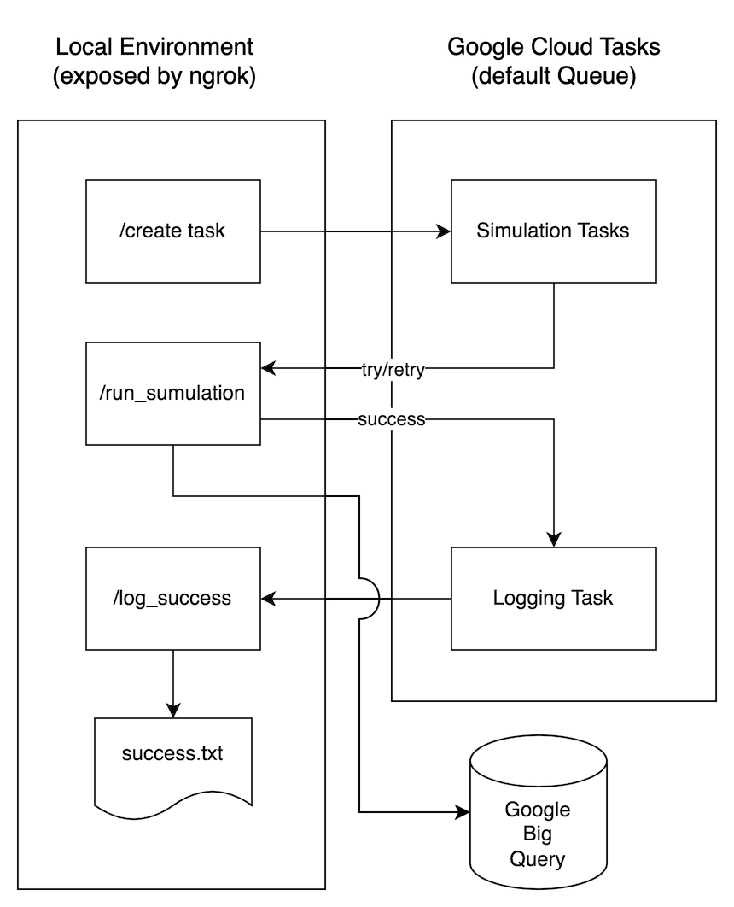

# Autocase POC

This POC provides smaple code to illustrate how Google Tasks and Google Big Query may be used in the Autocase application simulations.  Google Tasks is used to handle and retry simulation failures and Big Query is used to store simulation results in a database.

## Installation

This POC uses Docker to host the application so that it may be run locally or hosted in a service like Google Cloud Run.  

### Running Locally
If running the application locally, make sure that Docker is installed.  Additionally, a public url must be generated for your local environment so that Google Cloud Tasks can initiate simulations.  To do this, create a free account with [ngrok](https://dashboard.ngrok.com/signup).  **An account must be created to enable callbacks to the task queue.**  Follow instructions after signup to install ngrok locally.

Once ngrok is installed, start the service with the command:

`ngrok http 8080`

The output will look something like:

```
ngrok                                                                                                                                                                
Introducing Pay-as-you-go pricing: https://ngrok.com/r/payg                                                                                                                                                                                                                                                        
                                                                                                                                                                                                                                                                                                                   
Session Status                online                                                                                                                                                                                                                                                                               
Account                       Anthony Chamberas (Plan: Free)                                                                                                                                                                                                                                                       
Version                       3.5.0                                                                                                                                                                                                                                                                                
Region                        United States (us)                                                                                                                                                                                                                                                                   
Latency                       46ms                                                                                                                                                                                                                                                                                 
Web Interface                 http://127.0.0.1:4040                                                                                                                                                                                                                                                                
Forwarding                    https://948d-108-20-21-168.ngrok-free.app -> http://localhost:8080                                                                                                                                                                                                                   
                                                                                                                                                                                                                                                                                                                   
Connections                   ttl     opn     rt1     rt5     p50     p90                                                                                                                                                                                                                                          
                              131     0       0.00    0.00    3.01    6.67       
```

Make note of the Forwarding address (i.e. `https://xxxx-xxx-xx-xx-xxx.ngrok-free.app`) as this will need to be used when running the Docker container.

### Build and Run Docker Image

To build the Docker image run this command in root folder of the application:

`docker build . -t autocase_poc`

This will install all necessary libraries in the image.  After the image builds, open a new terminal window and run the container:

`docker run --name autocase_poc -p 8080:8080 --env PORT=8080 --env BACKEND_URL=<ngrok forwarding address> autocase_poc`

## Execution

Test that the service is running by visiting `http://localhost:8080` in a browser.  You should see the message:

`Hello World! The app is running.`

To call the service, use `curl` (in a new terminal window) or Postman with the endpoint `http://localhost:8080/create_task` and `POST` the payload:

```
{
    "wait": 0,
    "fail_rate": 0.3
}
```

If the tasks are generated successfully, the response will be:

`tasks created to run simulation with 6 iterations`

## Results

**NOTE:** The simulation imitates random failures to illustrate Cloud Task retry logic.

Open the "default" [Google Task Queue](https://console.cloud.google.com/cloudtasks/queue/us-central1/default/tasks?authuser=3&project=autocase-201317) to see tasks created for each iteration of the simulation.  A task for each iteration will be shown.  As the iteration completes successfully, the task will disappear from the list.  If a task fails, the number of retrys will be noted.

View the terminal window running ngrok to see the successful (`200 OK`) and failed (`500 INTERNAL SERVER ERROR`) simulation iterations, as well as successfully logged results.  

View the terminal window running the Docker container to see execution messages and failures.

Open the table `simulation_poc.simulation` in [Google Big Query](https://console.cloud.google.com/bigquery?authuser=3&project=autocase-201317&ws=!1m5!1m4!4m3!1sautocase-201317!2ssimulation_poc!3ssimulation) and click the `PREVIEW` tab to see the simulation results.

## Configure Cloud Tasks

To modify the configuration for the default Cloud Task queue, run this command with the Google Cloud CLI installed

```
gcloud tasks queues update default \
       --max-attempts=100 \
       --min-backoff=3s \
       --max-backoff=10s \
       --max-doublings=16 \
       --max-retry-duration=60s
```
or modify the queue in the Google Cloud UI.

## Service Workflow

The diagram below illustrates the workflow of this service.



## Sample Code

The following code can be run in a Jupyter notebook or Python CLI, in place of `curl` or Postman, to test the service.

```
import requests
import json

url = "http://localhost:8080/create_task"

payload = json.dumps({
  "wait": 1,
  "fail_rate": 0.75
})
headers = {
  'Content-Type': 'application/json'
}

response = requests.request("POST", url, headers=headers, data=payload)

print(response.text)
```